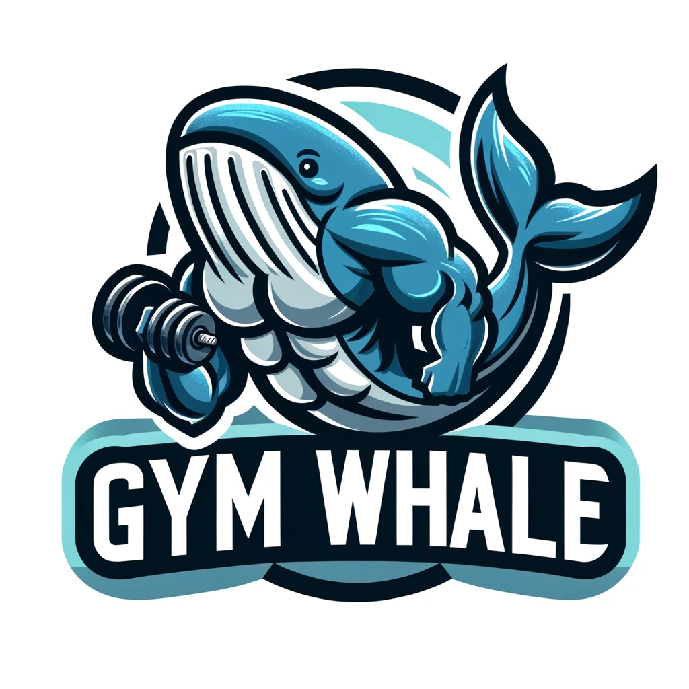

# Overview

Welcome to **Gym Whale**, where fitness meets fashion! Our brand is dedicated to those who live and breathe the gym lifestyle, offering a range of clothing that combines comfort, style, and performance. Whether you're lifting weights, running on the treadmill, or stretching in a yoga class, our apparel is designed to support your fitness journey while making you look great. Join the **Gym Whale** family and embrace your passion for fitness with every workout!

## Objectives 

* We want to simplify the process by which customers can purchase our mechandise.
* We're here to implement a web application that meets the requirements outlined in this document.
* We'll be using the Scrum methodology to implement this web application.

## Features 

1. Users **must** be able to authenticate themselves. This means that they can both log-in and log-out using our web-interface.
2. Our customers **must** be able to order mechandise from our website.
3. Our customers **must** be able to track their own orders, including the status of the order.
4. We as administrators **must** be able to change the status of any order. 
5. We as administrators **must** be able to update the merchandise catalog. 

# User Stories

This section outlines the main User Stories that are expected to be implemented for Gym Whale

## US#1: User Registration/Authentication - 3 Points

As users of our website, one should be able to register themselves onto our platform, so that they can purchase merchandise on our website. They should be able to sign-up with the following criteria: Name, Username, Address and Password. Then the same user should be able to log-in using their Username and Password.

## US#2: Merchandise Viewing - 8 Points

As logged-in customer on our platform, one should be able to look at all the merchandise that we're selling. The Customer should also be able to sort our products by price, and also maybe the type of clothing. (Ex: Pants, Shirts, Accessory)

## US#3: Merchandise Maintenance  - 10 Points

As a logged-in administrator to our platform, we should be able to add, edit, delete any of the merchandise that we plan on selling/unlisting and etc. 

## US#4: Merchandise Purchasing  - 10 Points

As a logged-in customer to our platform, the customer should be able to purchase the merchandise that's listed on our platform. At the start, we may implement where they can only buy one merchandise per transaction. As the platform gets more optimized, we may implement a shopping-cart system where the customer can purhcase more than one merchandise per transaction.

## US#5: Merchandise Rating  - 15 Points

As a logged-in customer to our platform, the customer should be able to rate all the merchandise that's listed on our platform. They should be able to rate the product 1-5 stars, and the product will show the average rating from all the customers that rated it previously. Once that's implemented, we may also implement a review system where a customer can write comments on any of the products. 
